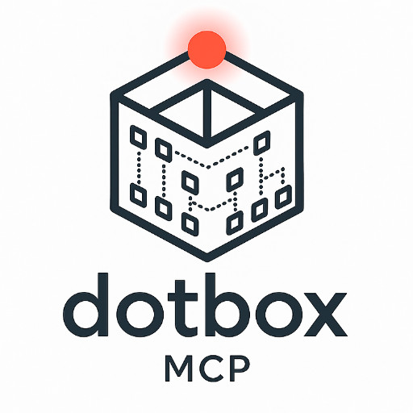

<div align="center">
  

  <p>
    <a href="https://github.com/domibies/dotbox-mcp/releases"></a>
    <a href="https://github.com/domibies/dotbox-mcp/actions"></a>
    
    <a href="LICENSE"></a>
  </p>
</div>

# dotbox-mcp

A Model Context Protocol (MCP) server that enables LLMs to execute .NET workloads in isolated Docker containers. Write C# code, build projects, host web APIs, and test across multiple .NET versions.

**Currently supports:** Claude Desktop only
**Platforms:** 🍎 macOS | 🪟 Windows

Built with FastMCP (Python) and Docker SDK.

> ⚠️ **Important (2025-11-03 08:00):** If you installed before this date and are experiencing Docker permission errors, please reinstall using the automatic installer or update your manual config to use `"--user", "1000:0"` instead of detecting the Docker GID. See [Manual Installation](#manual-installation) for details.

## What is dotbox-mcp?

**dotbox-mcp is a specialized tool for rapid .NET experimentation and prototyping in Claude Desktop** - not a replacement for full-fledged coding agents like Claude Code or Cursor.

> **Note:** Currently only Claude Desktop is supported. Future support for other MCP clients (VS Code, Cursor, etc.) may be added.

**Use dotbox-mcp when you want to:**
- Quickly test a .NET feature or API
- Prototype a small Minimal API or console app
- Compare behavior across .NET versions (8, 9, 10)
- Execute snippets without setting up a local environment
- Experiment with NuGet packages in isolation

**Use Claude Code when you need:**
- Full codebase navigation and editing
- Multi-file projects with git integration
- Comprehensive testing and debugging
- Production-ready application development

**Security through isolation:** All .NET code runs in ephemeral Docker containers with resource limits, read-only filesystems (except `/workspace`), and automatic cleanup. Containers are destroyed after use, ensuring no persistent state or security risks.


*Example: Claude building a complete API Key Management service with CRUD endpoints, in-memory storage, and key validation - from prompt to running API in seconds.*

## Features

This MCP server is designed around **agent-centric workflows** - providing complete end-to-end tools rather than low-level Docker commands:

- **Quick C# Snippets**: Execute C# code instantly without project setup
- **Full Project Management**: Create, build, and run complete .NET projects (console apps, web APIs, class libraries)
- **Multi-Version Testing**: Compare code behavior across .NET 8, 9, and 10 RC2 in parallel
- **Web API Hosting**: Start web servers in containers with external port mapping for real HTTP testing
- **Resource Management**: Automatic container cleanup, timeout handling, and resource limits

Under the hood, it manages Alpine-based Docker images with .NET SDKs, handles build/execution orchestration, and formats output to stay within MCP's constraints.

## Quick Start

### macOS Installation (Claude Desktop)

**Requirements:**
- macOS with Docker Desktop installed and running
- Claude Desktop

**Automatic Installation (Recommended):**

```bash
curl -fsSL https://raw.githubusercontent.com/domibies/dotbox-mcp/main/scripts/install-claude-desktop.sh | bash
```

**What the installer does:**
- Verifies Docker is installed and running
- Updates Claude Desktop config (preserves other MCP servers)
- Pre-pulls Docker images (~1GB)
- Configures to use published Docker images from GHCR

**Manual Installation:**

1. **Edit Claude Desktop config** (`~/Library/Application Support/Claude/claude_desktop_config.json`):
   ```json
   {
     "mcpServers": {
       "dotbox-mcp": {
         "command": "docker",
         "args": [
           "run",
           "--rm",
           "-i",
           "--add-host",
           "host.docker.internal:host-gateway",
           "--user",
           "1000:0",
           "-v",
           "/var/run/docker.sock:/var/run/docker.sock",
           "ghcr.io/domibies/dotbox-mcp:latest"
         ]
       }
     }
   }
   ```

   **Notes:**
   - The `--user 1000:0` runs the container as non-root user with root group access (required for Docker socket)
   - The `--add-host` flag enables the MCP server to access web APIs hosted in sandbox containers via the host machine's port mappings

2. **Restart Claude Desktop**

**Note for manual installation:** Your first request might fail or timeout while Docker images are downloading (~1GB, 1-2 minutes). Simply wait a minute, restart Claude Desktop, and try again. The automatic installer pulls images during installation to avoid this delay.

### Windows Installation (Claude Desktop)

**Requirements:**
- Windows 10 or Windows 11
- Docker Desktop
- Claude Desktop

**Automatic Installation (Recommended):**

Open PowerShell and run:

```powershell
irm https://raw.githubusercontent.com/domibies/dotbox-mcp/main/scripts/install-claude-desktop.ps1 | iex
```

**What the installer does:**
- Checks Docker Desktop is installed
- Verifies Docker TCP port 2375 is enabled (provides setup instructions if not)
- Updates Claude Desktop config at `%APPDATA%\Claude\claude_desktop_config.json`
- Pre-pulls Docker images (~1GB)
- Configures to use published Docker images from GHCR

**Prerequisites Setup:**

1. **Install Docker Desktop:**
   - Download from https://docs.docker.com/desktop/install/windows-install/
   - Start Docker Desktop

2. **Enable Docker TCP port (required):**
   - Open Docker Desktop
   - Go to **Settings** > **General**
   - Enable **"Expose daemon on tcp://localhost:2375 without TLS"**
   - Click **Apply & Restart**

   ⚠️ **Security Note:** This exposes Docker API without authentication. Only enable on trusted networks (localhost/private).

**Manual Installation:**

1. **Edit Claude Desktop config** (Press `Win + R`, type `%APPDATA%\Claude`, press Enter, then open `claude_desktop_config.json`):
   ```json
   {
     "mcpServers": {
       "dotbox-mcp": {
         "command": "C:\\Program Files\\Docker\\Docker\\resources\\bin\\docker.exe",
         "args": [
           "run",
           "--rm",
           "-i",
           "--add-host",
           "host.docker.internal:host-gateway",
           "-e",
           "DOCKER_HOST=tcp://host.docker.internal:2375",
           "ghcr.io/domibies/dotbox-mcp:latest"
         ]
       }
     }
   }
   ```

   **Notes:**
   - Uses native Docker Desktop path (adjust if installed elsewhere)
   - Requires Docker TCP port 2375 enabled (see prerequisites above)
   - Uses `DOCKER_HOST` environment variable to connect to Docker daemon

2. **Restart Claude Desktop**
   - **Windows:** Click waffle menu (top-left) → **File** → **Exit** (closing the window keeps Claude running in background)
   - **macOS:** Quit Claude Desktop from the menu

**Note for manual installation:** Your first request might fail or timeout while Docker images are downloading (~1GB, 1-2 minutes). Simply wait a minute, restart Claude Desktop, and try again. The automatic installer pulls images during installation to avoid this delay.

### After Installation

1. **Restart Claude Desktop**
   - **Windows:** Waffle menu (☰) → **File** → **Exit**, then restart
   - **macOS:** Quit and restart Claude Desktop
2. Try asking Claude: *"Execute this C# code: Console.WriteLine(DateTime.Now);"*

### Troubleshooting

**macOS:**
- **Docker must be running** - Start Docker Desktop before using Claude Desktop
- Check config: `~/Library/Application Support/Claude/claude_desktop_config.json`
- Check logs: `~/Library/Application Support/Claude/logs/mcp-server-dotbox-mcp.log`

**Windows:**
- **Docker Desktop must be running** - Start Docker Desktop before using Claude Desktop
- **Verify TCP port 2375 is enabled:**
  - Test: Open browser to `http://localhost:2375/version` (should show Docker version JSON)
  - Enable: Docker Desktop > Settings > General > "Expose daemon on tcp://localhost:2375 without TLS"
- **Check docker.exe path:**
  - Default: `C:\Program Files\Docker\Docker\resources\bin\docker.exe`
  - If installed elsewhere, update the `command` path in config
- Check config: `%APPDATA%\Claude\claude_desktop_config.json`
- Check logs: `%APPDATA%\Claude\logs\mcp-server-dotbox-mcp.log`

## Example Prompts

**Note:** Request output display explicitly when you want to see formatted results.

**Quick Code Snippets:**

```
Generate 10 fake Person records in C# using the Bogus library and run it.
Display the JSON output in an artifact so I can see it properly formatted.
```

```
Write and execute C# code using LINQ to group products by category and calculate average prices.
Show me the results in an artifact.
```

```
Generate 10 random pronounceable passwords of length 12 in C#.
Execute it and show me the output. Explain how you did it and show the code in an artifact.
```

```
Show me a quick example of a new feature in .NET 10 and run it.
```

**Web APIs (run in background):**

```
Create and host a simple .NET 8 URL shortener API with in-memory storage. Include:
  - POST /api/shorten (takes long URL, returns short code)
  - GET /{shortCode} (redirects to original URL)
  - GET /api/stats/{shortCode} (shows click count)
Host it in the background and give me the URLs to test.
```

```
Build a .NET 9 API for generating and validating temporary access codes (like 2FA tokens).
Host it in the background so I can test creating and verifying codes.
```

---

## Known Issues & Future Improvements

### Performance
- **Slow container startup**: First execution per .NET version can take 5-10 seconds as containers spin up
  - *Potential mitigation*: Container pooling (pre-warmed containers ready to accept work)

### User Experience
- **Task management**: No built-in task tracking or multi-step workflow guidance from MCP
  - *Nice to have*: MCP protocol extensions for progress tracking and step-by-step execution hints

### Contributing

**Have ideas for improvements?** We welcome contributions! If you can implement container pooling, improve startup times, or enhance the user experience, please submit a PR. Check out our [Development & Contributing](#development--contributing) section below for guidelines.

---

## Development & Contributing

**Status:** ✅ MVP Complete - All core tools working, improvements and optimizations in progress.

For contributors who want to modify the code or test unreleased features:

### Requirements

- Python 3.10+
- Docker Desktop
- uv (dependency manager)

### Setup

1. **Clone and install dependencies:**
   ```bash
   git clone https://github.com/domibies/dotbox-mcp.git
   cd dotbox-mcp
   uv sync
   ```

2. **Build Docker images:**
   ```bash
   cd docker
   ./build-images.sh
   ```

### Running in Claude Desktop (Development Mode)

**Note:** Development workflow is currently macOS-only.

Use the toggle script to switch between development modes:

**Option 1: Development with uv (recommended for code changes)**
```bash
# Configure Claude Desktop to run from source with uv
python3 scripts/toggle-claude-desktop-config.py dev

# Restart Claude Desktop
```

This mode:
- Runs server from source via uv
- Hot-reloads on code changes
- Uses local Docker images
- Best for TDD workflow

**Option 2: Development with Docker (test containerized setup)**
```bash
# Build all images (sandbox + server)
./scripts/build-docker-dev.sh

# Configure Claude Desktop to run in Docker
python3 scripts/toggle-claude-desktop-config.py docker

# Restart Claude Desktop
```

This mode:
- Runs server in container (closer to production)
- Tests Docker-in-Docker setup
- Uses local images tagged `:dev`
- Best for testing deployment issues

**Switch back to production:**
```bash
python3 scripts/toggle-claude-desktop-config.py production
```

All toggle operations preserve other MCP servers in your config.

### Testing

```bash
# Unit tests (fast, mocked Docker)
uv run pytest -v -m "not e2e"

# E2E tests (requires Docker running, pulls images as needed)
uv run pytest -v -m e2e

# With coverage
uv run pytest --cov=src --cov-report=term-missing -m "not e2e"
```

### Git Workflow

**Always work on feature branches:**
```bash
git checkout -b feature/your-feature
# Make changes, commit, push
git push -u origin feature/your-feature
# Create PR via GitHub
```

Never push directly to main - all changes go through PRs with CI validation.

## License

[MIT](LICENSE) - Copyright (c) 2025 [domibies](https://github.com/domibies)
